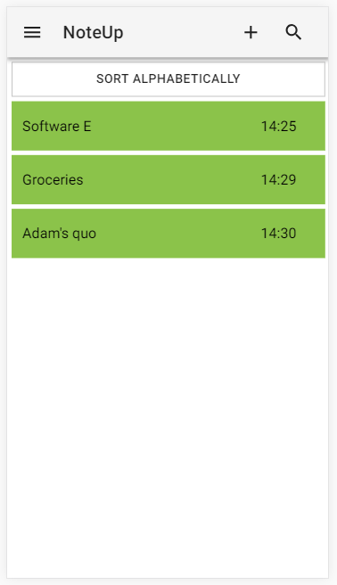
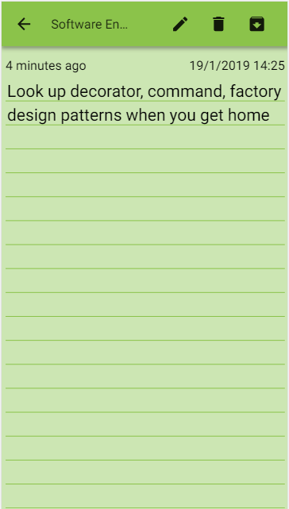
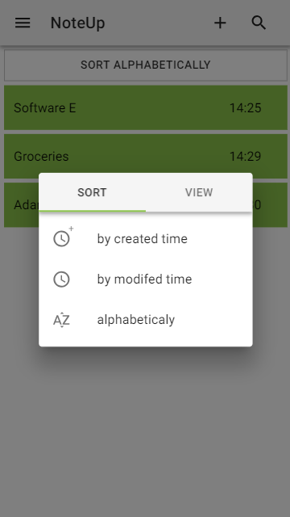
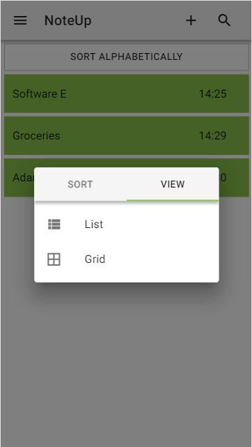

# Noteup
Application for writing small notes and reminders. Application is hosted on [github](https://97ashrey.github.io/noteUp/#/).
## Motivation
Reasoning behind this application is to test and improve my react knowledge. I frequently take notes on my phone during short lectures or when i have a series of tasks to complete. Thus i decided to reverse engineer some functionalities and UI design of [Color Note](https://play.google.com/store/apps/details?id=com.socialnmobile.dictapps.notepad.color.note) mobile app which i use. 
## Built with

 - [React](https://reactjs.org/)
 - [Material-UI](https://material-ui.com/)
 - [Styled components](https://www.styled-components.com/)
## Features
Applications has full crud (create, read, update, delete) capabilities. You can also archive notes, chose between sorting options (alphabetically, time of creation, etc..), change how they are displayed (grid, list). If you end up taking to many notes there is a search option to help.

  
  
  
  

## Prerequisites
[Nodejs](https://nodejs.org/en/) should be installed on the machine you are using.
## Installation
If you want to run this on your machine clone the repository, open the root of the project and run **npm install** to get all the dependencies. This was built with [create-react-app](https://github.com/facebook/create-react-app) so after installing is finished just run **npm run start**.
## Project structure
This section will explain some of the major folders in the project.
"components" folder contains global components that can be used by any other component in the component tree.
"scenes" folder contains all of "pages" for the application.
"services" folder contains utility functions and constants
If a component consists of other components and services that are used and built only for this one component, a folder with a name of the component is created. It contains index.js file and components and services folder containing those "special made" components and services.
Because of this you will see a lot of index.js files in the project structure so don't be confused by it.
## Conclusion
Building this improved my understanding of [React](https://reactjs.org/) and forced my eye at some of the design patterns like higher order components and render props.  I still have to take a deeper look at [React](https://reactjs.org/) life cycle methods especially since some of them are now deprecated and replaced with newer ones. It also sparked an interest in mobile applications and with [React Native](https://facebook.github.io/react-native/) i could try out that field. Maybe Java classes in school are gonna pay of too :). 

 
